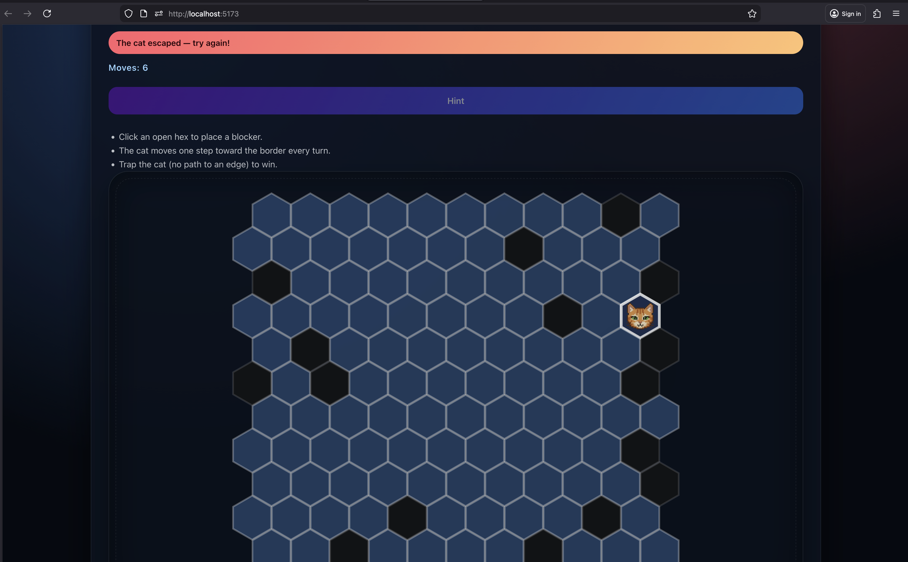

# Catch the Cat 🐱

A web-based puzzle game where you must trap a cat by strategically blocking hex tiles before it reaches the edge of the board. Built with React, TypeScript, and Vite.




## 🎮 How to Play

1. **Pick a difficulty** from the dropdown and press **Start game** to seed the board (fewer seeded blockers = harder).
2. **Click** on any open hex tile to place a blocker
3. The cat will automatically move one step toward the nearest edge each turn
4. **Win** by blocking all possible paths to the edge, trapping the cat
5. **Lose** if the cat reaches any edge of the board

### Features

- 🎯 **Hint System**: Get suggestions on optimal blocking moves
- 📊 **Move Counter**: Track your progress
- 🎨 **Responsive Design**: Play on desktop or mobile devices
- ♿ **Accessible**: Full keyboard navigation support
- 🧠 **Adaptive Difficulty**: The BFS pathfinding logic and seeded blockers
  determine how aggressively the cat can escape
- 🎚️ **Difficulty Presets**: Easy/Normal/Hard presets adjust seeded blockers;
  more blockers create easier boards, fewer blockers make the cat harder to trap
  and the **Start game** button regenerates the board with your choice

## 🚀 Getting Started

### Prerequisites

- Node.js 18+ and npm

### Installation

1. Clone the repository:
```bash
git clone https://github.com/yourusername/catch-the-cat.git
cd catch-the-cat
```

2. Install dependencies:
```bash
npm install
```

3. Start the development server:
```bash
npm run dev
```

4. Open your browser and navigate to `http://localhost:5173`

### Build for Production

```bash
npm run build
```

The production build will be in the `dist` directory.

### Preview Production Build

```bash
npm run preview
```

## 🏗️ Project Structure

```
catch-the-cat/
├── src/
│   ├── components/          # React components
│   │   ├── ControlPanel.tsx # Game controls and status
│   │   └── HexBoard.tsx     # Hexagonal grid board
│   ├── hooks/
│   │   └── useCatchTheCat.ts # Game logic and state management
│   ├── assets/
│   │   └── catch-the-cat/
│   │       └── cat.png      # Cat sprite
│   ├── App.tsx              # Main app component
│   ├── App.css              # App styles
│   ├── index.css            # Global styles
│   └── main.tsx             # Entry point
├── public/                  # Static assets
├── index.html               # HTML template
└── package.json             # Dependencies and scripts
```

## 🧩 Technical Details

### Technologies Used

- **React 19** - UI framework
- **TypeScript** - Type safety
- **Vite** - Build tool and dev server
- **react-hexgrid** - Hexagonal grid rendering

### Game Logic

The game uses a **Breadth-First Search (BFS)** algorithm to:
- Find the shortest path from the cat's position to any edge
- Determine optimal cat movement
- Check win/loss conditions

## ⚙️ Difficulty System

- Game difficulty explicitly ties to the BFS algorithm's path choosing; longer,
  more open paths give the cat more escape options.
- The number of predefined obstacles on the map (`INITIAL_BLOCKERS`) sets the
  baseline challenge before the player makes a move—fewer blockers means a
  harder board.
- Tweaking either dimension lets you prototype easy, normal, or hard boards
  without touching the rest of the logic.
- The in-app difficulty selector wires directly to these presets; hit **Start
  game** any time to regenerate the grid with the selected blocker count.

### Hexagonal Grid

The game uses an **even-r (pointy-top)** hexagonal coordinate system:
- Each hex has axial coordinates (q, r, s)
- Neighbor calculation accounts for row parity
- Responsive layout adapts to screen size

## 🎨 Customization

### Grid Size

Modify `GRID_WIDTH` and `GRID_HEIGHT` in `src/hooks/useCatchTheCat.ts`:

```typescript
const GRID_WIDTH = 11
const GRID_HEIGHT = 11
```

### Initial Blockers

Change `DEFAULT_BLOCKERS` and the `DIFFICULTY_PRESETS` map to adjust global
defaults and per-preset blocker counts:

```typescript
export const DEFAULT_BLOCKERS = 10

const DIFFICULTY_PRESETS = {
  easy: { label: 'Easy', blockers: 6 },
  normal: { label: 'Normal', blockers: DEFAULT_BLOCKERS },
  hard: { label: 'Hard', blockers: 14 },
} as const
```

## 📝 Scripts

- `npm run dev` - Start development server
- `npm run build` - Build for production
- `npm run preview` - Preview production build
- `npm run lint` - Run ESLint

## 🤝 Contributing

Contributions are welcome! Please feel free to submit a Pull Request.

## 📄 License

This project is open source and available under the [MIT License](LICENSE).

## 🙏 Acknowledgments

- Built with modern React patterns and best practices

---

Made with ❤️ using React and TypeScript
